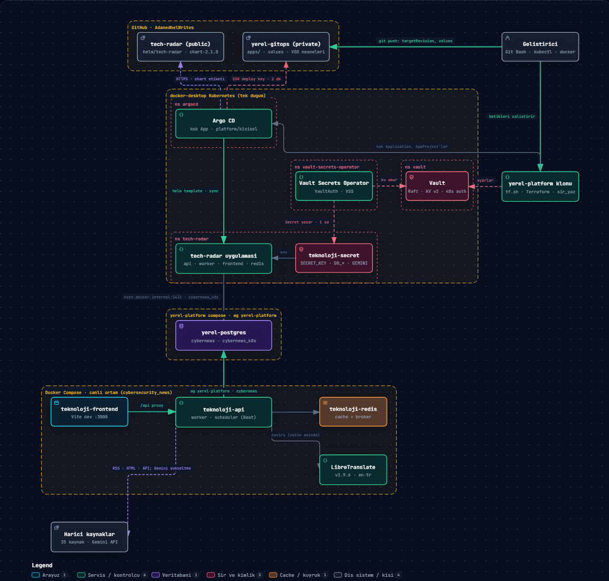

# Teknoloji Radar

Siber guvenlik haberleri, CVE zafiyetleri, Kubernetes ekosistemi, SRE (Site Reliability Engineering) haberleri, DevTools altyapi araclari guncellemeleri ve yapay zeka (AI) gelismelerini **48 farkli kaynaktan** toplayan, Turkceye ceviren ve modern bir arayuzde sunan full-stack haber agregasyon uygulamasi.

> Bu proje **Vibe Coding** yaklasimiyla, Claude Code (claude-opus-4-6) ile birlikte gelistirilmistir.

| | |
|---|---|
| **Uygulama surumu** | `appVersion` 2026.10.1 (CalVer; imaj etiketi) |
| **Helm chart** | 2.1.0 (SemVer; etiket `chart-2.1.0`) — [CHANGELOG](helm/tech-radar/CHANGELOG.md) |
| **Calisma zamani** | Python 3.11, Django 5.2, Node 22, PostgreSQL 16, Redis 7 |
| **Testler** | 462 Django testi (`news/tests/`), PostgreSQL uzerinde CI'da kosar |
| **Dagitim** | Docker Compose (canli, yerel) · Helm (generic) · Argo CD + Vault (yerel GitOps, ADR-0008) |
| **Lisans** | MIT |

**Icindekiler:** [Mimari](#mimari) · [Ozellikler](#ozellikler) · [Veri Kaynaklari](#veri-kaynaklari) · [Teknoloji Yigini](#teknoloji-yigini) · [Kurulum](#kurulum-docker-compose) · [Gelistirme ve Test](#gelistirme-ve-test) · [Kullanim](#kullanim) · [API](#api-endpoints) · [Entegrasyon API v1](#entegrasyon-api-apiv1) · [Proje Yapisi](#proje-yapisi) · [Ceviri Sistemi](#ceviri-sistemi) · [Periyodik Cekim](#periyodik-cekim-celery-beat) · [Surumleme](#surumleme) · [Kubernetes / Helm](#kubernetese-deploy-etme-helm) · [CI ve Guvenlik Hatti](#ci-ve-guvenlik-hatti) · [Operasyon ve Sorun Giderme](#operasyon-ve-sorun-giderme) · [Ortam Degiskenleri](#ortam-degiskenleri) · [Belgeler ve Yol Haritasi](#belgeler-ve-yol-haritasi) · [ADR](#mimari-kararlar-adr)

---

## Mimari

### Yerel topoloji



Okunusu, yukaridan asagiya:

- **GitHub**: `tech-radar` chart'i `chart-<surum>` etiketiyle sunar; `yerel-gitops` kumede ne calisacagini tutar. Gelistirici yalniz `yerel-gitops`'a push eder.
- **docker-desktop Kubernetes**: Argo CD iki repoyu okur (chart HTTPS ile, GitOps reposu salt okunur SSH deploy key ile, 2 dakikada bir) ve `tech-radar` namespace'ini senkron tutar. Vault Secrets Operator Vault'tan `kv/tech-radar/uygulama`'yi okuyup `teknoloji-secret`'i yazar; uygulama Secret'i `env` olarak alir. Argo CD, VSO ve Vault'u Terraform kurar; Terraform ayrica Vault'u (KV, auth, politikalar) ve Argo CD'nin kok Application'ini ayarlar.
- **yerel-platform PostgreSQL**: tek sunucu, iki veritabani. K8s uygulamasi `host.docker.internal:5432` uzerinden `cybernews_k8s`'e, compose `yerel-platform` agi uzerinden `cybernews`'e baglanir.
- **Docker Compose**: canli ortam. api/worker/scheduler Redis'i cache ve broker olarak, LibreTranslate'i cekim aninda ceviri icin kullanir; 35 harici kaynagi ve Gemini API'yi disaridan ceker.

Gorsel Archify ile uretildi; etkilesimli HTML surumu repo disinda tutulur.

### Compose ici bilesenler

```
                 ┌──────────────────────┐
                 │   React Frontend     │  Vite dev server (compose) /
                 │   Vite + Bootstrap 5 │  Nginx (imaj, K8s)
                 │   :3000              │
                 └──────────┬───────────┘
                            │ /api proxy
                 ┌──────────▼───────────┐        ┌───────────────────────┐
                 │  Django REST API     │◄──────►│  PostgreSQL 16        │
                 │  Gunicorn, DRF       │        │  yerel-platform       │
                 │  /api/* (arayuz)     │        │  (ayri repo, paylasilan│
                 │  /api/v1/* (dis API) │        │   yerel-postgres:5432) │
                 └───┬─────────────┬────┘        └───────────────────────┘
                     │             │
          ┌──────────▼──┐   ┌──────▼─────────────────────┐
          │  Redis 7    │◄──┤  Celery Worker + Beat       │
          │  cache +    │   │  cekim · ceviri · retranslate│
          │  broker     │   │  6 saatte bir / 2 saatte bir │
          └─────────────┘   └──────┬───────────────┬──────┘
                                   │               │
                      ┌────────────▼────┐   ┌──────▼──────────────┐
                      │ 35 harici kaynak│   │ Ceviri saglayicilari│
                      │ RSS · HTML · API│   │ LibreTranslate (yerel)│
                      └─────────────────┘   │ Gemini (yukseltme)   │
                                            └─────────────────────┘
```

Ayni kod uc bicimde calisir:

| Ortam | Ne icin | Nasil kurulur | Veritabani |
|---|---|---|---|
| **Docker Compose** | Canli yerel ortam (gunluk kullanim) | `docker compose up -d --build` | `yerel-postgres` / `cybernews` |
| **Helm (generic)** | Herhangi bir Kubernetes kumesi | `helm upgrade --install` ([bolum](#kubernetese-deploy-etme-helm)) | chart ici PostgreSQL ya da harici |
| **Argo CD + Vault (yerel GitOps)** | Paralel deneme ortami, docker-desktop | `yerel-gitops` reposuna commit; platform `yerel-platform` Terraform'u ([ADR-0008](docs/ADR-0008-Yerel-GitOps-Terraform-ArgoCD-Vault.md)) | `yerel-postgres` / `cybernews_k8s` |

## Ozellikler

- **48 farkli kaynak** — 12 siber guvenlik, 6 CVE, 3 Kubernetes, 5 SRE, 14 DevTools, 8 Yapay Zeka; hepsi anahtarsiz ve ucretsiz (GitHub API icin istege bagli `GITHUB_TOKEN`)
- **Asenkron cekim** — "Getir" istegi Celery worker'a devredilir; arayuz 5 saniyede bir yeni kayitlari otomatik yansitir
- **Periyodik cekim** — Celery Beat tum bolumleri 6 saatte bir otomatik gunceller (sadece yeni kayitlar cevrilir)
- **Yonetici korumali sifirlama** — Veritabanini silen `clear` endpoint'leri yalnizca Django admin oturumuyla calisir
- **Tam makale cevirisi** — Kisaltma yok, tum icerik Turkceye cevrilir
- **Teknik terim korumasi** — 130+ terim (Kubernetes, Docker, Elasticsearch, CVE, CVSS, vb.) ceviri sirasinda bozulmaz
- **Turkce imla post-processing** — Cumle basi buyuk harf, noktalama duzeltme, URL/surum koruma
- **Parca tabanli ceviri** — Uzun makaleler cumle sinirlarindan 4500 karakterlik parcalara bolunerek cevrilir
- **Karanlik mod** — Koyu tonlarda arayuz (steel blue `#5b86a7` vurgu rengi)
- **DevTools takibi** — MinIO, Seq, Ceph, MongoDB, PostgreSQL, RabbitMQ, Elasticsearch+Kibana, Redis, Moodle, LiteLLM, LangGraph, Langfuse, GitLab, Keycloak release guncellemeleri
- **CISA KEV** — Aktif somurulen zafiyetler (Known Exploited Vulnerabilities) CVE bolumunde ayri kaynak; NVD API'sinin `hasKev` filtresiyle, eklenme tarihi ve federal son tarih bilgisiyle
- **Tarih filtresi** — 1-30 gun (haberler) / 1-90 gun (CVE, Kubernetes, SRE, Yapay Zeka) / 1-120 gun (DevTools) slider ile filtreleme (`news/serializers.py` sinirlari)
- **Yeniden denemeli cekim** — Gecici 429/5xx ve baglanti hatalarinda 2 ek deneme, ussel bekleme, `Retry-After`'a uyum (`news/base_scraper.oturum_kur`); onceden tek bir 503 kaynagi o tur bos birakiyordu
- **CVSS siddet filtresi** — Kritik / Yuksek / Orta / Dusuk (CVE sayfasi)
- **HTML rapor disa aktarma** — Her bolumden koyu temali, yazdirilabilir HTML rapor indirilebilir
- **Entegrasyon API (`/api/v1/`)** — Token'li, imlecli delta okuma; OpenAPI 3 semasi ve Swagger UI; manuel tetikleme ve is takibi ([ADR-0003](docs/ADR-0003-Entegrasyon-API-v1.md))
- **Cekim gorunurlugu** — Her cekim `FetchRun` olarak kaydedilir; `GET /api/v1/status/` bolum basina tazelik ve son durum verir ([ADR-0006](docs/ADR-0006-FetchRun-Gorunurlugu-ve-Status-Ucu.md))
- **Ceviri rozetleri** — Her kayit saglayicisini tasir (LibreTranslate / Gemini); bekleyen cevirilerde Ingilizce metin kaybolmaz
- **Docker Compose** — Tek komutla 6 container ayaga kalkar (PostgreSQL ayri `yerel-platform` reposunda paylasilir)
- **Kubernetes** — Surumlu Helm chart (SemVer + CHANGELOG, CI kapilari); Argo CD Sync hook modu ve harici Secret destegi
- **GitOps + Vault** — Yerel docker-desktop'ta Terraform ile kurulan Argo CD + HashiCorp Vault + Vault Secrets Operator zinciri; sirlar git'e ve state'e girmez ([ADR-0008](docs/ADR-0008-Yerel-GitOps-Terraform-ArgoCD-Vault.md))
- **Guvenlik hatti** — 9 GitHub Actions is akisi: test/build/Helm kapisi, CodeQL, Trivy (kaynak + imaj + SBOM), gitleaks, ZAP DAST, Dependency Review, zizmor, OpenSSF Scorecard, chart etiketi kapisi ([plan](docs/GUVENLIK-PLANI.md))

---

## Veri Kaynaklari

### Siber Guvenlik Haberleri (12 kaynak)

| Kaynak | Yontem | Aciklama |
|--------|--------|----------|
| The Hacker News | HTML Scraping | Tam makale icerigi cekilir |
| Bleeping Computer | HTML Scraping | Sponsorlu icerik filtrelenir; Cloudflare Chrome UA'sini 403'ledigi icin Firefox UA, tur basina 10 makale ve 1 sn bekleme (429) |
| SecurityWeek | RSS + tam makale | RSS linkleri tasir, govde makale sayfasindan cekilir (ana sayfa HTML'inde link bos geliyordu) |
| Dark Reading | RSS Feed | HTML 403 dondugu icin RSS kullanilir |
| Krebs on Security | HTML Scraping | Brian Krebs'in guvenlik blogu |
| The Record | RSS + tam makale | Recorded Future'in haber sitesi |
| CyberScoop | RSS Feed | Tam metin `content:encoded` icinde gelir |
| Help Net Security | RSS + tam makale | Sektor haberleri, arastirma ozetleri |
| Infosecurity Magazine | RSS Feed | Kisa ozet; govde makale sayfasindaki paragraflardan tamamlanir |
| SANS ISC | RSS Feed | Internet Storm Center gunlukleri; tam metin RSS'te |
| The Register | RSS Feed | Security bolumu; tam metin RSS'te |
| Security Affairs | RSS Feed | Tam metin `content:encoded` icinde gelir |

> Yeni RSS kaynaklari `scraper_multi.RSSNewsSource` ile okunur: tur basina en fazla 15 haber, `days` penceresi, 200 karakterden kisa ozetler makale sayfasindan tamamlanir. Feed'den gelen linkler yalniz kaynagin kendi kok alaninda ve `https` ise acilir (`news/base_scraper.link_guvenli`; SSRF korumasi, bkz. [GUVENLIK-PLANI 3a](docs/GUVENLIK-PLANI.md)). `fetch_all_news` tavani kaynak sayisiyla buyur (`max(30, 3 x kaynak)`), boylece seyrek yazan kaynaklar (Krebs, SANS) tarih siralamasinda dusmez.

### CVE Zafiyetleri (6 kaynak)

| Kaynak | Yontem | Aciklama |
|--------|--------|----------|
| CISA KEV | NVD REST API (`hasKev`) | Son `days` gunde KEV katalogu'na eklenen, aktif somurulen CVE'ler; baslikta CISA'nin zafiyet adi, aciklamada eklenme ve son tarih. cisa.gov JSON akisi bot korumasi nedeniyle 403 dondugu icin NVD uzerinden |
| NVD (Yayinlanan) | REST API | Yeni yayinlanan CVE'ler |
| NVD (Guncel) | REST API | Son guncellenen CVE'ler |
| GitHub Advisory | REST API | CVSS, CWE, etkilenen paketler dahil |
| Tenable | HTML Scraping | Severity bilgisi dahil |
| CIRCL | REST API | Luksemburg CERT |

### Kubernetes (3 kaynak)

| Kaynak | Yontem | Aciklama |
|--------|--------|----------|
| Kubernetes Blog | HTML Scraping | Resmi Kubernetes blog yazilari |
| Kubernetes GitHub | REST API | Release notlari, CHANGELOG formatinda |
| CNCF Blog | WordPress API | Cloud Native Computing Foundation haberleri |

### SRE (5 kaynak)

| Kaynak | Yontem | Aciklama |
|--------|--------|----------|
| SRE Weekly | RSS Feed | Haftalik bulten, bireysel makalelere ayristirilir |
| InfoQ SRE | RSS Feed | `feed.infoq.com/sre/` konu akisi (HTML kartlari istemci tarafinda cizildigi icin RSS'e gecildi) |
| PagerDuty Eng | RSS Feed | Incident management ve SRE makaleleri |
| Google Cloud SRE | RSS Feed | SRE anahtar kelime filtresiyle |
| DZone DevOps | RSS Feed | `feeds.dzone.com/devops-and-cicd` (eski `/devops` adresi olu bir porta yonlendiriyordu) |

### DevTools — Altyapi Araclari (14 kaynak)

| Kaynak | Yontem | Aciklama |
|--------|--------|----------|
| MinIO | GitHub Releases API | S3 uyumlu object storage, detayli changelog. **Ust kaynak Ekim 2025'ten beri GitHub'da surum yayinlamiyor**; kaynak bilincli olarak tutuluyor, yeni kayit beklenmez |
| Seq | Datalust Blog RSS | Yapilandirilmis log arama motoru, release filtreli |
| Ceph | GitHub Releases Atom | Dagitik storage, version tag tabanli |
| MongoDB | GitHub Tags Atom + mongodb.com release notes | Stabil `rX.Y.Z` tag'leri; aciklama resmi surum notlari sayfasindaki surum basligindan (blog RSS'i Haziran 2026'da donmustu) |
| PostgreSQL | Resmi News RSS | Resmi haberler, release notlari, ekosistem |
| RabbitMQ | GitHub Releases API | Mesaj kuyrugu, tam changelog |
| Elasticsearch + Kibana | GitHub Releases API + elastic.co release notes | Resmi release notes sayfasindan detayli changelog |
| Redis | Blog RSS + tam makale | Blog sayfasindan tam icerik cekilir (blockContent) |
| Moodle | GitHub Tags API + moodledev.io | Resmi release notes sayfasindan gercek icerik |
| LiteLLM | GitHub Releases API | LLM gateway; yalniz `vX.Y.Z` stabil surumler (gunluk dev/rc/backport elenir) |
| LangGraph | GitHub Releases API | Ajan orkestrasyonu; cekirdek `X.Y.Z`, `sdk==` ve `cli==` paketleri (checkpoint/prebuilt elenir) |
| Langfuse | GitHub Releases API | LLM gozlemlenebilirlik; `vX.Y.Z` surumleri, changelog |
| GitLab | docs.gitlab.com surum Atom'u | Ay surumleri ve yama surumleri, tam surum notu (`gitlab.com/api/v4` anonim istege 403 donuyor) |
| Keycloak | GitHub Releases API | Kimlik yonetimi; `X.Y.Z` surumleri (nightly elenir) |

> LiteLLM, LangGraph, Langfuse ve Keycloak `devtools_scraper.GitHubReleasesScraper` ortak sinifiyla okunur (tag deseni + prerelease elemesi). GitHub API anonim limiti 60 istek/saat/IP'dir; `GITHUB_TOKEN` verilirse yalniz `api.github.com` isteklerine eklenir (bkz. [Ortam Degiskenleri](#ortam-degiskenleri)). `fetch_all` tavani kaynak sayisiyla buyur (`max(30, 3 x kaynak)`).

### Yapay Zeka (8 kaynak)

| Kaynak | Yontem | Aciklama |
|--------|--------|----------|
| Hugging Face | RSS Feed | Model, dataset ve kutuphane duyurulari |
| MIT Tech Review AI | RSS Feed | Tam makale icerigi RSS icinde gelir |
| MarkTechPost | RSS Feed | Arastirma ve model haberleri |
| AWS ML Blog | RSS Feed | AWS makine ogrenmesi blogu |
| TechCrunch AI | RSS Feed | AI sektor haberleri |
| Google DeepMind | RSS Feed | DeepMind arastirma blogu |
| KDnuggets | RSS Feed | Veri bilimi ve ML yazilari |
| OpenAI Blog | RSS Feed | OpenAI duyurulari |

> Tum AI kaynaklari `news/base_scraper.py` icindeki ortak `BaseRSSScraper` ile okunur; RSS aciklamasi 200 karakterden kisaysa makale sayfasindan paragraf cekilir. Benchmark/leaderboard skorlari kapsam disidir (bkz. [ADR-0002](docs/ADR-0002-AI-Benchmark.md)).

---

## Teknoloji Yigini

| Katman | Teknolojiler |
|--------|-------------|
| **Backend** | Python 3.11, Django 5.2, Django REST Framework 3.18, drf-spectacular (OpenAPI 3), django-csp, Celery 5.6 + django-celery-beat, Gunicorn 22, Whitenoise |
| **Frontend** | React 18, Vite 6, React Bootstrap 2.9, React Router DOM 7, Axios, react-hot-toast; Node 22 |
| **Veri** | PostgreSQL 16 (compose ve K8s; SQLite yalniz `DEBUG=True` ile hostta), Redis 7 (cache + Celery broker, django-redis) |
| **Scraping** | BeautifulSoup4, lxml, Requests |
| **Ceviri** | Cekim aninda yerel LibreTranslate 1.9.6 (aninda Turkce, rozetli); retranslate 2 saatte bir bekleyen ve LibreTranslate kayitlarini Gemini API (gemini-3.5-flash-lite, ucretsiz katman, kayit basina tek istek) ile yukseltir + merkezi post-processing |
| **Konteyner / dagitim** | Docker Compose, cok asamali Dockerfile'lar (non-root, digest sabitli taban imajlar), Nginx 1.31 (frontend imaji), Helm chart `tech-radar` |
| **Platform (ayri repolar)** | `yerel-platform`: paylasilan PostgreSQL + Terraform (Argo CD, Vault, VSO); `yerel-gitops`: Argo CD Application'lari ve ortam degerleri |
| **CI / guvenlik** | GitHub Actions, CodeQL, Trivy, gitleaks, OWASP ZAP, Dependency Review, zizmor, OpenSSF Scorecard, Dependabot, kubeconform |

Tam surumler [`requirements.txt`](requirements.txt) ve [`frontend/package.json`](frontend/package.json) dosyalarindadir; Dependabot bunlari haftalik gunceller.

---

## Kurulum (Docker Compose)

### Gereksinimler

- Docker ve Docker Compose
- Internet baglantisi (kaynak sitelere ve Gemini API'ye erisim icin; LibreTranslate yerel container'da calisir)
- Paylasilan yerel PostgreSQL (`yerel-platform` reposu) ayakta ve `cybernews` veritabani olusturulmus

### Hizli Baslangic

`.env.example`'i `.env` olarak kopyalayin. `SECRET_KEY` (`openssl rand -hex 32`) ve `DB_PASSWORD` (yerel-platform'daki `cybernews` kullanicisinin parolasi) zorunludur; `GEMINI_API_KEY` istege baglidir (bos birakilirsa Gemini hic denenmez, sistem LibreTranslate ile calisir). Veritabani ayri `yerel-platform` reposundaki paylasilan PostgreSQL'dir; compose'dan once orada `docker compose up -d` calismis olmalidir:

```bash
git clone https://github.com/AdanedhelWrites/tech-radar.git
cd tech-radar/cybersecurity_news

cp .env.example .env
docker compose up -d --build
```

| Servis | URL |
|--------|-----|
| Frontend | http://localhost:3000 |
| Backend API | http://localhost:8000/api/ |

### Container'lar

| Container | Image | Port | Gorev |
|-----------|-------|------|-------|
| `teknoloji-api` | `teknoloji-haberleri-api:latest` | 8000 | Django REST API, scraping, ceviri |
| `teknoloji-frontend` | `node:22-alpine` | 3000 | React arayuz (Vite dev server, hot-reload; kaynak bind mount) |
| `teknoloji-translate` | `libretranslate/libretranslate:v1.9.6` | — (kume ici 5000) | Yerel ceviri; yalniz `en,tr` modelleri, ilk acilista ~258 MB indirir (volume `teknoloji-translate-models`); 4 CPU / 2 GB siniri |
| `teknoloji-redis` | `redis:7-alpine` | 6379 | Cache + Celery message broker (volume `teknoloji-redis-data`) |
| `teknoloji-worker` | `teknoloji-haberleri-api:latest` | — | Arka plan scraping + ceviri (`celery worker`) |
| `teknoloji-scheduler` | `teknoloji-haberleri-api:latest` | — | Periyodik gorev zamanlayici (`celery beat`) |
| `yerel-postgres` (ayri repo: `yerel-platform`) | `postgres:16.15-alpine` | 127.0.0.1:5432 | Paylasilan yerel PostgreSQL; CyberNews `cybernews` veritabanini ve kullanicisini kullanir |

Container'lar `teknoloji-network` bridge agi uzerinden haberlesir; api, worker ve scheduler ayrica `yerel-platform` adli **dis** aga baglanir (PostgreSQL oradadir). Compose kaynak kodu `/app`'e bind mount eder; api `entrypoint.sh` ile acilista `migrate` + `collectstatic` calistirir (`RUN_STARTUP_TASKS=true`). Ayni imaj Kubernetes'te salt okunur kok dosya sistemiyle ve bu adimlar kapali calisir.

### Yonetim Komutlari

```bash
# Baslat
docker compose up -d --build

# Durdur
docker compose down

# Loglari izle
docker compose logs -f teknoloji-api
docker compose logs -f teknoloji-worker

# Redis cache temizle
docker compose exec teknoloji-redis redis-cli FLUSHDB

# PostgreSQL shell
docker exec -it yerel-postgres psql -U cybernews -d cybernews

# Django shell
docker compose exec teknoloji-api python manage.py shell

# Sifirdan baslat (volume'lar dahil)
docker compose down -v && docker compose up -d --build
```

### Veri tasima (SQLite -> PostgreSQL)

2026-10'da canli veri SQLite'tan PostgreSQL'e tasindi ([ADR-0007](docs/ADR-0007-PostgreSQL-Gecisi-ve-Helm-Dogrulamasi.md)). Ayni araclar her iki yonde calisir:

```bash
# Tam hassasiyetli dump (mikrosaniye ve metin bosluklari korunur). Dosya HASSASTIR:
# parola hash'leri ve API token'lari icerir; commit etmeyin, is bitince silin.
python manage.py veri_tasi_dump .fazb/dump.json
# Hedefte: migrate, sonra standart loaddata
python manage.py loaddata .fazb/dump.json
# Iki veritabaninda calistirip ciktilari karsilastirin; fark yoksa tasima kayipsizdir
python manage.py veri_ozeti
```

Django'nun `dumpdata` komutu bu is icin kullanilmaz: JSON bicimi tarihleri milisaniyeye kirpar (v1 imleci mikrosaniye tasir), XML bicimi metin bosluklarini kaybeder.

### Yonetici Hesabi

"Sifirla" butonlari (`POST /api/{bolum}/clear/`) veritabanini sildigi icin yalnizca Django admin yetkisiyle calisir; oturum yoksa 403 doner. Ilk kurulumda bir yonetici olusturun:

```bash
docker compose exec teknoloji-api python manage.py createsuperuser
```

Ardindan `http://localhost:8000/admin/` adresinden giris yapin. Oturum cerezi ayni tarayicidaki frontend isteklerinde de kullanilir; axios CSRF token'i `csrftoken` cerezinden otomatik ekler.

---

## Gelistirme ve Test

### Testler

462 Django testi `news/tests/` altindadir ve `news/test_runner.py` (`GuvenliTestRunner`) ile kosar. Calistirici uc garanti verir: hicbir test gercek LibreTranslate'e gitmez (`LIBRETRANSLATE_URL` bos), hicbir test gercek Gemini'ye gitmez (`GEMINI_API_KEY` bos), hicbir test canli Redis devre kesicisini okumaz veya acmaz (kapilar surec ici). Saglayici testleri adresi/anahtari `override_settings` ile kendileri verir ve HTTP'yi mock'lar.

```bash
# Canli compose yigininda (ayni PostgreSQL sunucusunda ayri test veritabani acilir)
docker compose exec teknoloji-api python manage.py test news --noinput

# Tek kullanimlik PostgreSQL + Redis ile, canli yigina dokunmadan (CI ile ayni yol)
scripts/pg_test.sh test news --noinput

# Hostta SQLite ile hizli deneme (DEBUG=True, DB_HOST bos)
scripts/pg_test.sh --sqlite test news.tests.test_cursor
```

Frontend'de ESLint (flat config, `frontend/eslint.config.js`; `npm run lint`) CI'da build'den once kosar: `@eslint/js` onerilenleri, `react-hooks/rules-of-hooks` (hata) ve `exhaustive-deps` (uyari). Bolum sayfalarindaki 5 sn'lik liste yenileme `hooks/useAraliklaYenile` ile sekme arka plandayken durur.

CI (`Backend (Django testleri)`) testleri PostgreSQL 16 servisiyle, `DEBUG=False` ve gercek bir `SECRET_KEY` ile kosar; migration'larin eksiksiz oldugu (`makemigrations --check`) ayni iste dogrulanir. Yeni bir test yazarken kodu gecici olarak bozup testin kirmiziya dondugunu gorun; mock'lanmis saglayici testlerinde "yesil ama hicbir seyi sinamiyor" tuzagi kolaydir.

| Test dosyasi grubu | Kapsam |
|---|---|
| `test_cursor`, `test_filters`, `test_refresh`, `test_jobs`, `test_status`, `test_schema`, `test_auth` | `/api/v1/` sozlesmesi: imlec, parametreler, kilit/soguma, is takibi, status, OpenAPI, token |
| `test_translation*`, `test_gemini`, `test_retranslate` | Terim koruma, parca bolme, post-processing, saglayici zinciri, devre kesici, butce, yukseltme |
| `test_saklama`, `test_fetchrun`, `test_eski_fetch_kapisi` | `RETENTION_DAYS` sil/yeniden yaz dongusu, FetchRun kaydi, eski `/api/*/fetch/` uclarinin v1 kapisindan gecmesi |
| `test_ayar_dogrulama`, `test_admin`, `test_cache`, `test_altyapi`, `test_modeller` | `SECRET_KEY`/`DB_HOST` korumalari, admin yetkisi, cache, model kisitlari |
| `test_migrations_*`, `test_veri_tasima` | Veri migration'lari ve SQLite -> PostgreSQL tasima araclari |

### Hostta calistirma

`DEBUG` varsayilani `False` oldugu icin anahtarsiz `python manage.py ...` reddedilir. Yerelde iki secenek:

```bash
# Konteynerde (onerilen; ortam compose'tan gelir)
docker compose exec teknoloji-api python manage.py <komut>

# Hostta SQLite ile (yalniz deneme)
DEBUG=True python manage.py <komut>
```

Frontend icin `frontend/` altinda `npm install && npm run dev` yeterlidir; `vite.config.js` `/api`'yi `localhost:8000`'e proxy'ler. Compose'daki dev sunucusu calisirken hosttan `npm install` yapmayin (bind mount `node_modules` ve EACCES); once `docker compose stop teknoloji-frontend`.

### Yonetim komutlari ve betikler

| Komut / betik | Ne yapar |
|---|---|
| `manage.py veri_tasi_dump <dosya>` | Tam hassasiyetli (mikrosaniye koruyan) JSON dump; hassas icerik, commit edilmez |
| `manage.py veri_ozeti` | Model basina satir sayisi ve alan ozeti; iki veritabanini karsilastirmak icin |
| `manage.py bozuk_cevirileri_isaretle` | Turkce metninde `XTRM` yer tutucu kalintisi olan kayitlari bulup `needs_translation` isaretler |
| `scripts/pg_test.sh` | Tek kullanimlik PostgreSQL + Redis'e karsi `manage.py`; canli yigina dokunmaz |
| `scripts/ornek_istemci.py` | `/api/v1/` delta senkron ornegi (yalniz standart kutuphane) |
| `scripts/helm_yerel_dogrulama.sh imaj\|kur\|sok` | Chart'i yalniz `docker-desktop`'ta gercek kurulumla dogrular (S1-S7) |
| `scripts/chart_surum_kontrol.sh <taban-ref>` | Chart dizini degistiyse `Chart.yaml version` artmis ve CHANGELOG girdisi var mi (CI kapisi) |
| `scripts/imaj_etiket_kontrol.sh <render.yaml>` | Render'daki imajlar etiketli mi, `latest` yok mu, ucuncu taraf imajlar digest ile sabit mi (CI kapisi) |
| `scripts/chart_etiket_kontrol.sh chart-<surum>` | `chart-*` etiketi `Chart.yaml` ile ayni mi (etiket push'unda CI kapisi) |
| `scripts/zap_sarif.py <report_json.json> <cikti.sarif>` | ZAP baseline JSON raporunu SARIF 2.1.0'a cevirir (DAST is akisi Security sekmesine yukler) |

### Kod kurallari

- Kod, yorum ve commit mesajlari ASCII Turkce (diakritiksiz). `main` korumalidir: her degisiklik bir daldan PR ile gelir, bes zorunlu check (`Backend`, `Frontend`, `Helm / Compose`, `dependency-review`, `gitleaks`) yesil ve dal `main` ile guncel olmadan merge edilemez; dogrudan push kapalidir.
- Her onemli karar bir ADR'dir (`docs/ADR-*.md`); tasarim ve uygulama planlari `docs/superpowers/` altindadir.
- Sir degerleri (anahtar, parola, token) hicbir dosyaya, log'a veya ekrana yazilmaz; `.env` ve `.fazb/` gitignore'dadir, gitleaks her PR'da tarar.
- `helm/tech-radar/` altindaki her degisiklik chart surumunu artirir ve CHANGELOG girdisi ister (bkz. [Surumleme](#surumleme)).

---

## Kullanim

Her sayfa ayni duzeni takip eder:

1. Sol panelden **gun araligini** (1-15 / DevTools ve Yapay Zeka icin 1-60) ve **kaynaklari** secin
2. **"Getir"** butonuna tiklayin
3. Cekim arka planda (Celery worker) baslar; cevrilen haberler orta panele birkac saniye icinde otomatik duser
4. Bir habere tiklayarak sag panelde detayini goruntuleyin

**Ek butonlar:**
- **Yenile** — Mevcut verileri yeniden yukler
- **Sifirla** — Tum verileri temizler (yonetici girisi gerekir, bkz. [Yonetici Hesabi](#yonetici-hesabi))
- **Indir** — Koyu temali HTML rapor olarak disa aktarir

---

## API Endpoints

Her bolum (news, cve, k8s, sre, devtools, ai) ayni endpoint yapisini kullanir:

| Method | Endpoint Deseni | Aciklama |
|--------|-----------------|----------|
| GET | `/api/{bolum}/` | Kayitli verileri listele |
| POST | `/api/{bolum}/fetch/` | Arka planda cekim baslat — Celery task (body: `{"days": 7, "sources": [...]}`) |
| POST | `/api/{bolum}/clear/` | Tum verileri sil (**yonetici oturumu gerekir**, aksi halde 403) |
| GET | `/api/{bolum}/stats/` | Istatistikleri getir |
| GET | `/api/{bolum}/export/` | HTML rapor olarak disa aktar |

**Bolum isimleri:** `news` (Siber Guvenlik, fetch endpoint: `/api/fetch/`), `cve`, `k8s`, `sre`, `devtools`, `ai`

> **Not:** Siber guvenlik bolumunun fetch, clear, stats ve export endpoint'leri `/api/news/` altinda degil, dogrudan `/api/` altindadir: `/api/fetch/`, `/api/clear/`, `/api/stats/`, `/api/export/`

---

## Entegrasyon API (`/api/v1/`)

Yukaridaki `/api/*` uc noktalari React arayuzune hizmet eder. **Dis tuketici uygulamalar `/api/v1/` kullanmalidir:** token ister, cache'e hic bakmaz, imlecli delta ile hicbir kaydi atlamadan ve tekrar islemeden senkron yapilmasini saglar. Karar gerekcesi icin [ADR-0003](docs/ADR-0003-Entegrasyon-API-v1.md).

Calisan ornek: [`scripts/ornek_istemci.py`](scripts/ornek_istemci.py) — alti bolumu bastan sona ceker, imleci diske yazar, yalnizca standart kutuphane kullanir.

### Token alma

Token'lar Django admin'den uretilir ve iptal edilir:

```bash
# Kullanici olustur (yoksa) ve token uret
docker compose exec teknoloji-api python manage.py shell -c "
from django.contrib.auth.models import User
from rest_framework.authtoken.models import Token
u, _ = User.objects.get_or_create(username='entegrasyon')
print(Token.objects.get_or_create(user=u)[0].key)
"
```

Her istekte `Authorization: Token <key>` basligi gonderilir. Admin arayuzunde **Auth Token → Tokens** ekranindan da uretilebilir ve iptal edilebilir.

### Uc noktalar

| Method | Uc nokta | Aciklama |
|--------|----------|----------|
| GET | `/api/v1/schema/` | OpenAPI 3 semasi (token gerekir) |
| GET | `/api/v1/docs/` | Swagger UI — tarayicida admin oturumuyla acilir |
| GET | `/api/v1/health/` | Servis ayakta mi — **tokensiz** (Kubernetes probe'lari icin) |
| GET | `/api/v1/status/` | Bolum basina veri tazeligi: `last_success_at`, `last_status`, `last_fetched_count`, `last_saved_count`, `pending_translation`, `total`; kaynak sagligi: `sources{ad: last_record_at, last_fetched_count, zero_runs, silent}` ve `silent_sources[]` (`SOURCE_SILENT_RUNS` ardisik turda 0 kayit donen kaynak) |
| GET | `/api/v1/{bolum}/` | Imlecli delta okuma |
| POST | `/api/v1/{bolum}/refresh/` | Tek bolum icin manuel cekim tetikler |
| POST | `/api/v1/refresh/` | Alti bolumu birden tetikler |
| GET | `/api/v1/jobs/{job_id}/` | Manuel tetiklenen isin durumu |

**Bolum isimleri:** `news`, `cve`, `kubernetes`, `sre`, `devtools`, `ai` — dikkat: v1'de `k8s` degil **`kubernetes`**.

### Delta dongusu

```bash
curl -H "Authorization: Token $CYBERNEWS_TOKEN" \
  "http://localhost:8000/api/v1/cve/?limit=200&min_severity=high"
```

Yanit zarfi:

```json
{
  "results": [ ... ],
  "next_cursor": "eyJ1IjoiMjAyNi0wOS0yMFQyMjowODo1Mi43MDE4MzErMDA6MDAiLCJpIjoxMDM2NX0",
  "has_more": true,
  "count": 200
}
```

Dongu: `next_cursor`'i sakla, bir sonraki istekte `?since_cursor=<deger>` olarak gonder, `has_more` `false` olana kadar tekrarla. **Imlec opaktir** — `(updated_at, id)` ikilisinin kodlanmis halidir, ic bicimi haber verilmeden degisebilir; acma, yalnizca sakla ve geri gonder. `next_cursor` bos sonucta bile doner ki saklayacak bir degerin hep olsun. Siralama her zaman `updated_at ASC, id ASC`'dir; bu **akis sirasidir, ekrana basma sirasi degildir**.

Ilk senkronda tum kayitlar yeni gorunur. Daraltmak icin `?since=YYYY-MM-DD` kullanilabilir (yalnizca imlec yokken gecerlidir).

| Parametre | Bolumler | Aciklama |
|-----------|----------|----------|
| `since_cursor` | hepsi | Opak imlec; verildiginde `since` yok sayilir |
| `since` | hepsi | `YYYY-MM-DD` — ilk senkronu daraltmak icin |
| `limit` | hepsi | Varsayilan 100, tavan 500 |
| `source` | hepsi | Virgulle ayrilmis kaynak adlari |
| `needs_translation` | hepsi | `true` / `false` — cevirisi bekleyenler |
| `min_severity` | `cve` | `low` \| `medium` \| `high` \| `critical` — esik ve uzeri |
| `severity` | `cve` | Virgulle ayrilmis tam eslesme (`critical,high`) |
| `category` | `kubernetes` | Virgulle ayrilmis kategori |
| `entry_type` | `devtools` | Virgulle ayrilmis tur |

Gecersiz parametre sessizce yok sayilmaz; `400 invalid_parameter` doner.

### Upsert anahtari — `id` kullanmayin

**Tuketici tarafi upsert (idempotent) olmalidir; salt insert cift kayit uretir.** `updated_at` icerik degismese de ilerleyebilir, yani ayni kayit akista birden fazla kez gorunur.

Birlestirme anahtari olarak **`id` kullanilmamalidir.** `id` kalici degildir: saklama penceresi (`RETENTION_DAYS`) disina dusen bir kayit silinir ve kaynak onu tekrar dondurdugunde **yeni bir `id` ile** geri gelir. Kararli anahtarlar:

| Bolum | Upsert anahtari |
|-------|-----------------|
| `cve` | **`cve_id`** |
| `news`, `kubernetes`, `sre`, `devtools`, `ai` | **`link`** |

Bunlar yazma yolunun da anahtarlaridir: `news/tasks.py` ayni alanlarla `update_or_create` yapar. Gerekce ve olcumler icin [ADR-0005](docs/ADR-0005-CVE-Saklama-ve-Gemini-Onceligi.md).

> **Uyari:** Bes bolumden dordunde (`kubernetes`, `sre`, `devtools`, `ai`) `link` veritabaninda `unique=True`, `cve` icin `cve_id` de oyle. **`news` bolumunde `link` uzerinde benzersizlik kisiti yoktur** — anahtar yazma yolunun sozlesmesidir, sema garantisi degildir. Tuketici kendi tarafinda benzersiz indeks tanimlamalidir.

Silmeler akista bildirilmez (tombstone yok); tuketici kendi saklama suresini uygular.

### Dil alanlari

Baslik ve aciklama ic ice doner ve severity normalize edilir:

```json
{
  "title":    { "original": "Critical RCE in ...", "tr": "... kritik RCE" },
  "severity": { "code": "critical", "label": "Kritik" },
  "needs_translation": false,
  "translation_provider": "gemini"
}
```

Tuketici `title.tr || title.original` yazarak cevirisi henuz hazir olmayan kayitta Ingilizceye duser — kayit kaybolmaz, Turkcesi hazir olunca `updated_at` ilerledigi icin ayni anahtar uzerine guncelleme gelir. Filtreler severity'nin **`code`** degeri uzerinden calisir.

### Manuel tetikleme

```bash
curl -X POST -H "Authorization: Token $CYBERNEWS_TOKEN" \
  http://localhost:8000/api/v1/cve/refresh/
```

`202` ile `{"job_id", "section", "status", "status_url"}` doner; durum `/api/v1/jobs/{job_id}/` ile izlenir. Uc katman korur: bolum kilidi (`REFRESH_LOCK_TTL`) cift kazimayi onler, **paylasilan** bolum sogumasi (`REFRESH_COOLDOWN`) kaynak siteleri ve ceviri kotasini korur, token basina hiz siniri tek istemciyi sinirlar. Sogumadaki bolum `429 cooldown` ve `Retry-After` basligi dondurur. Toplu `/api/v1/refresh/` her zaman `202` doner; govdede `started` / `already_running` / `skipped` listeleri bulunur.

### Hiz sinirlari

| Kapsam | Oran |
|--------|------|
| Okuma (`v1_read`) | token basina `120/dk` |
| Tetikleme (`v1_refresh`) | token basina `12/saat` |
| Bolum sogumasi | `REFRESH_COOLDOWN` (900 sn) — **tum token'lar arasinda paylasilir** |

### Hata sozlesmesi

Tum v1 hatalari ayni bicimde doner:

```json
{ "error": { "code": "invalid_cursor", "message": "Imlec cozulemedi: ..." } }
```

| Kod | HTTP | Ne zaman |
|-----|------|----------|
| `unauthorized` | 401 | Token yok, gecersiz veya iptal edilmis |
| `invalid_cursor` | 400 | `since_cursor` cozulemedi |
| `invalid_parameter` | 400 | Parametre bicimi veya degeri gecersiz |
| `not_found` | 404 | `refresh/` icin bilinmeyen bolum; bilinmeyen veya suresi dolmus `job_id` |
| `throttled` | 429 | Hiz siniri asildi |
| `cooldown` | 429 | Bolum sogumada (`Retry-After` basligi ile) |
| `internal` | 500 | Beklenmeyen sunucu hatasi |

> **Not:** Bu sozlesme yalnizca **tanimli** uc noktalar icin gecerlidir. Hic rotasi olmayan bir yol — ornegin `GET /api/v1/k8s/`, cunku v1'de bolum adi `kubernetes`'tir — DRF'e hic ulasmadan Django'nun duz **HTML 404**'unu dondurur, JSON gelmez. Tuketici yanit govdesini ayristirmadan once `Content-Type`'i kontrol etmelidir. Buna karsilik `POST /api/v1/k8s/refresh/` rotalidir ve duzgun `{"error": {"code": "not_found", ...}}` dondurur.

### Makine tarafindan okunur sozlesme

`/api/v1/schema/` OpenAPI 3 dokumani dondurur ve yalnizca `/api/v1/` uclarini
kapsar; eski `/api/*` uclari bilincli olarak disaridadir.

```bash
curl -H "Authorization: Token $CYBERNEWS_TOKEN" \
  http://localhost:8000/api/v1/schema/ -o cybernews-v1.yaml
```

Semadan istemci uretilebilir (`openapi-generator` vb.). `/api/v1/docs/` ayni
semayi Swagger UI ile gosterir; tarayici `Authorization` basligi gondermedigi
icin bu sayfa **admin'de oturum acmis** bir kullaniciyla acilir.

> **Not:** Sema yayimlandigi andan itibaren dis sozlesmedir. Bir alanin tipi
> degisirse bu artik "dokumantasyon hatasi" degil, tuketicinin istemcisini
> kiran bir degisikliktir.

---

## Proje Yapisi

```
cybersecurity_news/
├── cybernews/                  # Django proje ayarlari
│   ├── settings.py             # Env-var tabanli config (DB, Redis, CORS, CSP)
│   ├── guvenlik_basliklari.py  # Permissions-Policy, CORP, COEP middleware'i
│   ├── urls.py                 # Root URL yapilandirmasi
│   ├── celery.py               # Celery yapilandirmasi
│   └── wsgi.py
│
├── news/                       # Ana Django uygulamasi
│   ├── models.py               # NewsArticle, CVEEntry, KubernetesEntry, SREEntry, DevToolsEntry, AINewsEntry
│   ├── views.py                # API endpoint'leri (6 bolum x 5 endpoint = 30)
│   ├── tasks.py                # Celery task'lari (cekim + ceviri + cache)
│   ├── serializers.py          # DRF serializer'lari
│   ├── urls.py                 # API URL pattern'leri
│   ├── translation_utils.py    # Merkezi ceviri modulu (terim koruma + post-processing)
│   ├── translation_providers.py# Saglayici zinciri: LibreTranslate (cekim) + devre kesici
│   ├── gemini.py               # Gemini API istemcisi, hiz siniri, gunluk butce, CVE payi
│   ├── retranslate.py          # Bekleyenleri cevir + LibreTranslate kayitlarini Gemini'ye yukselt
│   ├── cache_utils.py          # Redis cache anahtarlari ve temizleme
│   ├── veri_tasima.py          # Tam hassasiyetli dump/ozet (SQLite -> PostgreSQL gecisi)
│   ├── test_runner.py          # GuvenliTestRunner: testler gercek saglayiciya gitmez
│   ├── management/commands/    # veri_tasi_dump, veri_ozeti, bozuk_cevirileri_isaretle
│   ├── tests/                  # 369 test (v1 sozlesmesi, ceviri, saklama, migration, ayar)
│   ├── base_scraper.py         # Ortak RSS okuyucu (BaseRSSScraper)
│   ├── ai_scraper.py           # 8 Yapay Zeka kaynagi scraper'i
│   ├── cve_scraper.py          # 5 CVE kaynagi scraper'i
│   ├── k8s_scraper.py          # 3 Kubernetes kaynagi scraper'i
│   ├── sre_scraper.py          # 5 SRE kaynagi scraper'i
│   ├── devtools_scraper.py     # 9 DevTools kaynagi scraper'i
│   ├── fetch_runs.py           # FetchRun satirlarini yazan Celery sinyalleri
│   ├── api_v1/                 # Dis tuketici entegrasyon katmani (ADR-0003)
│   │   ├── views.py            # Delta, refresh, jobs, status, health uc noktalari
│   │   ├── serializers.py      # v1 serializer'lari (alanlar tek tek yazilir)
│   │   ├── cursor.py           # (updated_at, id) keyset imleci
│   │   ├── filters.py          # Query parametresi ayristirma
│   │   └── refresh.py          # Bolum kilidi, soguma, job kaydi
│   └── admin.py                # Django admin kayitlari
│
├── scripts/
│   ├── ornek_istemci.py        # /api/v1/ delta senkron ornegi (stdlib-only)
│   ├── pg_test.sh              # Tek kullanimlik PostgreSQL + Redis ile manage.py / testler
│   ├── helm_yerel_dogrulama.sh # Chart'i yalniz docker-desktop'ta dogrular (S1-S7)
│   ├── chart_surum_kontrol.sh  # CI kapisi: chart degistiyse surum + CHANGELOG
│   ├── imaj_etiket_kontrol.sh  # CI kapisi: render'da etiketsiz / latest imaj yok
│   ├── chart_etiket_kontrol.sh # CI kapisi: chart-<surum> etiketi Chart.yaml ile ayni
│   └── zap_sarif.py            # ZAP JSON raporu -> SARIF (DAST bulgulari Security sekmesine)
│
├── scraper_multi.py            # 5 siber guvenlik kaynagi scraper'i
│
├── frontend/                   # React SPA
│   ├── src/
│   │   ├── App.jsx             # Router, Navbar, Karanlik Mod
│   │   ├── App.css             # Tema stilleri
│   │   ├── components/
│   │   │   ├── NewsComponent.jsx       # Siber guvenlik sayfasi
│   │   │   ├── CVEComponent.jsx        # CVE sayfasi
│   │   │   ├── KubernetesComponent.jsx # Kubernetes sayfasi
│   │   │   ├── SREComponent.jsx        # SRE sayfasi
│   │   │   ├── DevToolsComponent.jsx   # DevTools sayfasi
│   │   │   ├── AINewsComponent.jsx     # Yapay Zeka sayfasi
│   │   │   └── CeviriEtiketi.jsx       # Ceviri saglayici rozeti
│   │   └── services/
│   │       └── api.js          # Axios API servisleri
│   ├── Dockerfile              # Production build: Node 22 + Nginx 1.31 (non-root)
│   ├── .dockerignore           # node_modules bind mount'u build'i bozmasin
│   ├── nginx.conf              # SPA routing + /api proxy
│   ├── vite.config.js          # Dev proxy ayarlari
│   ├── index.html
│   └── package.json
│
├── docs/
│   ├── ADR-0001 ... ADR-0008   # Mimari karar kayitlari
│   ├── GUVENLIK-PLANI.md       # Guvenlik hatti: hatlar, bulgu yerleri, bekleyen isler
│   └── superpowers/
│       ├── specs/              # Tasarim belgeleri (karar + gerekce + testler)
│       └── plans/              # Uygulama planlari (gorev gorev) ve devir notlari
│
├── .github/workflows/          # CI, codeql, trivy, gitleaks, dast-zap, dependency-review,
│                               # zizmor, scorecard, chart-etiket (bkz. CI ve Guvenlik Hatti)
│
├── helm/tech-radar/            # Helm chart (tek dagitim kaynagi; surum: Chart.yaml)
│   ├── Chart.yaml              # version (SemVer) + appVersion (imaj etiketi)
│   ├── CHANGELOG.md            # Chart surumleri ve yukseltme notlari
│   ├── values.yaml             # Varsayilan degerler (gizli deger icermez)
│   ├── ci/yerel-values.yaml    # Yerel docker-desktop dogrulamasi
│   ├── ci/argocd-values.yaml   # CI'da Argo CD + VSO modunda render
│   ├── .helmignore
│   └── templates/
│       ├── _helpers.tpl        # Imaj, guvenlik baglami, ortam, ALLOWED_HOSTS yardimcilari
│       ├── configmap.yaml
│       ├── secret.yaml         # secretKey ve dbPassword zorunlu
│       ├── postgresql.yaml     # postgresql.enabled
│       ├── redis.yaml          # redis.enabled
│       ├── libretranslate.yaml # libretranslate.enabled
│       ├── backend.yaml
│       ├── frontend.yaml
│       ├── celery.yaml         # Worker + Beat
│       ├── migration-job.yaml  # helm: teknoloji-migrate-r<N>; argocd: sabit adli Sync hook
│       ├── ingress.yaml        # ingress.enabled
│       └── NOTES.txt
│
├── docker-compose.yml          # 6 servis (PostgreSQL ayri: yerel-platform)
├── Dockerfile                  # Backend multi-stage build (non-root, digest sabitli taban)
├── entrypoint.sh               # Startup: wait-for-db + migrate + collectstatic (compose)
├── requirements.txt            # Python bagimliliklari (surumler sabit)
├── SECURITY.md                 # Zafiyet bildirimi: GitHub private vulnerability reporting
├── .env.example                # SECRET_KEY, DB_PASSWORD (zorunlu), GEMINI_API_KEY, GITHUB_TOKEN
├── .gitleaksignore             # Gecmis commit'lere sabitli placeholder baseline'i (silinmez)
├── .gitignore                  # .env, .fazb/, db.sqlite3*, staticfiles/, node_modules
├── .dockerignore               # .env ve .env.* imaja girmez
└── manage.py
```

> Depo kokundeki `scraper*.py`, `gui*.py` ve `requirements_*.txt` dosyalari projenin ilk masaustu/CLI surumunden kalmadir; web uygulamasi bunlari kullanmaz.

---

## Ceviri Sistemi

Tum scraper'lar `news/translation_utils.py` merkezi modulunu kullanir. 3 katmanli mimari:

### 1. Teknik Terim Korumasi

Ceviri oncesinde 130+ teknik terim `XTRM####X` formatiyla placeholder'lara donusturulur. Ceviri sonrasi geri yerlestirilir. Ek olarak:

- **URL'ler** (`https://...`) otomatik korunur
- **Surum numaralari** (`v1.2.3`, `9.3.1`) otomatik korunur
- **CVE numaralari** (`CVE-2024-12345`) otomatik korunur
- **Backtick kod parcalari** (`` `kubectl get pods` ``) otomatik korunur
- **SIG etiketleri** (`[SIG Node]`) otomatik korunur
- **GitHub URL'leri** ve paket isimleri otomatik korunur

Terimler uzunluktan kisaya siralanarak islenir — kisa terimlerin kelime icinde eslesmesin onlenir.

### 2. Parca Tabanli Ceviri

Uzun metinler cumle sinirlarindan 4500 karakterlik parcalara bolunur (saglayici istek boyutu sinirlarini asmamak icin). Her parca icin ayri terim koruma uygulanir. LibreTranslate bu parcalari kendi icinde ayrica 160 karakterlik alt parcalara boler (`LIBRETRANSLATE_CHUNK_CHARS`); Gemini yukseltmesi kayit basina tek istekte calisir.

### 3. Turkce Post-Processing

Ceviri sonrasi otomatik duzeltmeler:

- Cumle basi ve satir basi buyuk harf
- Noktalama duzeltmeleri (noktadan sonra bosluk, parantez temizligi)
- URL/email/dosya uzantisi korumasi (post-processing'in `.co` -> `. Co` yapmasi engellenir)
- Ingilizce ay isimlerinin Turkceyecevirisi
- Bozuk Turkce karakter encoding duzeltmesi
- K8s kisaltmasinin korunmasi

### 4. Hiz Siniri ve Devre Kesici

- **LibreTranslate (cekim aninda)** — Baglanti hatasi, zaman asimi veya 5xx gelirse kendi Redis devre kesicisi `LIBRETRANSLATE_COOLDOWN` (60 sn, varsayilan) boyunca acilir; 4xx devre kesiciyi acmaz. Yeniden deneme ve ayri bir hiz siniri yoktur, eszamanlilik compose CPU siniriyla dogal olarak sinirlanir.
- **Gemini (retranslate yukseltmesi)** — Istekler arasi en az `GEMINI_MIN_INTERVAL` saniye (Redis uzerinden tum worker'lar icin ortak), gunluk `GEMINI_DAILY_BUDGET` istek tavani, 429/5xx sonrasi `GEMINI_COOLDOWN` saniye devre kesici.
- **Kayip yok** — Hicbir saglayici cevirmezse haber tam Ingilizce metniyle kaydedilir ve `needs_translation=True` isaretlenir; sonraki cekimde veya `retranslate_pending` turunde otomatik olarak yeniden denenir.

### 5. Retranslate ve Gemini Yukseltme

`retranslate_pending` Celery Beat gorevi her 2 saatte bir (tek saatlerde, dakika 05) calisir ve iki isi yapar: bekleyen (`needs_translation=True`) kayitlari LibreTranslate ile cevirir, ardindan `translation_provider='libretranslate'` kayitlari Gemini API (`gemini-3.5-flash-lite`) ile kayit basina tek istekte yukseltir. Yukseltme bolum basina `RETRANSLATE_UPGRADE_BATCH` kayitla sinirlidir. Eski `google` etiketli kayitlar yukseltilmez, etiketli kalir.

**Anahtar alma:** Google AI Studio (aistudio.google.com) → Get API key → Create API key; `cybersecurity_news/.env` icine `GEMINI_API_KEY=...` (gitignore'da). Kart gerekmez; kota asilirsa 429 doner, sistem LibreTranslate ile surer.

**Rozetler:** Her kayit `translation_provider` tasir; arayuzde `Makine çevirisi: LibreTranslate` (sari), `Çeviri: Gemini`, `Çeviri: Google` (eski kayitlar).

---

## Periyodik Cekim (Celery Beat)

`teknoloji-scheduler` container'i, `cybernews/settings.py` icindeki `CELERY_BEAT_SCHEDULE` ile tum bolumleri **6 saatte bir** (Europe/Istanbul 00:00, 06:00, 12:00, 18:00) otomatik gunceller. Worker ve ceviri yukunu dagitmak icin bolumler 10 dakika arayla kaydirilir:

| Bolum | Task | Dakika | Gun araligi |
|-------|------|--------|-------------|
| Siber Guvenlik | `fetch_news_task` | :00 | 7 |
| CVE | `fetch_cve_task` | :10 | 7 |
| Kubernetes | `fetch_k8s_task` | :20 | 30 |
| SRE | `fetch_sre_task` | :30 | 30 |
| DevTools | `fetch_devtools_task` | :40 | 30 |
| Yapay Zeka | `fetch_ai_news_task` | :50 | 30 |

Tum cekimler (manuel "Getir" dahil) `skip_existing=True` ile calisir: veritabaninda zaten cevrilmis kayitlar tekrar cevrilmez; yalnizca yeni haberler ve ceviri bekleyen (`needs_translation`) kayitlar LibreTranslate'e gonderilir. Gun araligi task varsayilanidir; her cekim (manuel "Getir" dahil) bu araligin disinda kalan eski kayitlari siler. Bekleyen ve LibreTranslate kayitlarinin Gemini ile yukseltilmesi ayri bir Beat gorevidir (bkz. [Retranslate ve Gemini Yukseltme](#5-retranslate-ve-gemini-yukseltme)): `retranslate_pending_task`, tek saatlerde dakika 05.

Her cekim bir `FetchRun` satiri birakir (bolum, baslangic/bitis, `fetched_count`, `saved_count`, durum, hata ozeti, kaynak basina `by_source`). Son durumlar `GET /api/v1/status/` ile okunur; Beat'in gercekten calistigini kontrol etmenin en kisa yolu budur ([ADR-0006](docs/ADR-0006-FetchRun-Gorunurlugu-ve-Status-Ucu.md)).

**Loglar (2026-10-08):** Scraper ve ceviri katmani `print` yerine `logging` kullanir; kaynak hatalari `WARNING` seviyesinde, modul adiyla (`news.devtools_scraper`, `scraper_multi`) gelir. `docker compose logs teknoloji-worker | grep WARNING` bir turda hangi kaynaklarin hata verdigini gosterir; `LOG_FORMAT=json` ile satirlar Loki/ELK'ye dogrudan gider. Worker Django `LOGGING` ayarini kullanir (`CELERY_WORKER_HIJACK_ROOT_LOGGER=False`).

**Kaynak sagligi (2026-10-08):** 8 kaynak aylarca sessizce olmustu (Bleeping Computer 403, SecurityWeek bos link, MongoDB/InfoQ/DZone donmus akislar); bolum toplami "success" gorundugu icin fark edilmedi. Artik her tur secili her kaynak icin kaynaktan gelen sayiyi (`_drop_existing`'den onceki) `FetchRun.by_source`'a yazar. `/api/v1/status/` her kaynak icin `zero_runs` (ardisik 0 donen tamamlanmis tur) ve `silent` verir; `SOURCE_SILENT_RUNS` (varsayilan 4 = Beat'te 24 saat) esigi asan kaynaklar `silent_sources` listesindedir. Admin'deki FetchRun listesinde "0 donen kaynaklar" sutunu ayni bilgiyi tur basina gosterir. Seyrek yazan kaynaklar (Krebs, PagerDuty) kendi `days` penceresinde yine kayit dondurdugu icin yanlis pozitif vermez; yeni kayit olmamasi degil, kaynaktan hic kayit gelmemesi sessizliktir. Haftalik kontrol: `curl .../api/v1/status/ | jq '.sections[].silent_sources'`.

---

## Surumleme

Uc ayri sayi vardir ve birbirine karistirilmamalidir:

| Ne | Nerede | Kural | Kim degistirir |
|---|---|---|---|
| **Uygulama surumu** | `helm/tech-radar/Chart.yaml` `appVersion`; imaj etiketi `teknoloji-haberleri-{api,frontend}:<appVersion>` | CalVer `YYYY.M.N` | Yeni uygulama surumunde gelistirici |
| **Chart surumu** | `Chart.yaml` `version` + git etiketi `chart-<version>` | SemVer: uyumsuz values/sablon MAJOR, yeni istege bagli deger MINOR, duzeltme PATCH; her surum `CHANGELOG.md`'de `## [surum]` basligi | Chart dizinine dokunan her PR |
| **Kumede calisan surum** | `yerel-gitops` reposunda Application'in `targetRevision`'i | Degismez `chart-*` etiketi; yukseltme = etiketi degistir, geri alma = `git revert` | GitOps reposuna commit |

CI bu kurallari zorlar:

- `scripts/chart_surum_kontrol.sh`: chart dizini degistiyse `version` artmis ve CHANGELOG girdisi var mi (CI, `Helm / Compose dogrulama`).
- `scripts/imaj_etiket_kontrol.sh`: render'da etiketsiz veya `latest` imaj yok, ucuncu taraf imajlar digest ile sabit.
- `scripts/chart_etiket_kontrol.sh`: `chart-*` etiketi push edilince `Chart.yaml` ile ayni surumu gosteriyor mu (`chart etiketi` is akisi).
- Dockerfile'lardaki taban imajlar digest ile sabittir; Dependabot digest guncellemelerini PR olarak acar.

Etiket yalniz chart icin vardir (`git tag chart-2.1.0 && git push origin chart-2.1.0`); uygulama icin GitHub Release veya registry yayini yoktur, imajlar yerelde `appVersion` etiketiyle derlenir.

---

## Kubernetes'e Deploy Etme (Helm)

Tek dagitim kaynagi `helm/tech-radar/` chart'idir; ham manifest isteyen `helm template` ciktisini kullanir. Chart surumu `Chart.yaml`'dadir ve SemVer'e uyar (uyumsuz degisiklik MAJOR, yeni istege bagli deger MINOR, duzeltme PATCH); her surumun degisiklikleri ve yukseltme notlari [`helm/tech-radar/CHANGELOG.md`](helm/tech-radar/CHANGELOG.md)'dedir ve CI bunu zorlar. `appVersion` uygulama imajinin etiketidir. Kararlar: [ADR-0007](docs/ADR-0007-PostgreSQL-Gecisi-ve-Helm-Dogrulamasi.md).

> **Guvenlik:** Asagidaki komutlar sablondur; `<...>` alanlarini kendi ortaminizla doldurun ve **her komutta hedef baglami acikca verin** (`--kube-context` / `--context`). Aktif `kubectl` baglamina guvenmeyin. Gizli degerleri values dosyasina yazmayin.

### On gereksinimler

- Kubernetes kumesi, `kubectl` ve Helm 3
- Kumenin cekebilecegi bir registry'de backend ve frontend imajlari
- Ingress kullanilacaksa bir Ingress Controller (`ingress.className`, varsayilan `nginx`)

### Imajlar

```bash
docker build -t <registry>/teknoloji-haberleri-api:<surum> .
docker build -t <registry>/teknoloji-haberleri-frontend:<surum> ./frontend
docker push <registry>/teknoloji-haberleri-api:<surum>
docker push <registry>/teknoloji-haberleri-frontend:<surum>
```

`image.tag` verilmezse chart `appVersion`'i kullanir.

### Kurulum

```bash
helm upgrade --install tech-radar ./helm/tech-radar \
  --kube-context <hedef-baglam> -n <namespace> --create-namespace \
  --set secrets.secretKey="<openssl rand -hex 32>" \
  --set secrets.dbPassword="<guclu-sifre>" \
  --set ingress.host=<alan-adi> \
  --set backend.image.repository=<registry>/teknoloji-haberleri-api \
  --set backend.image.tag=<surum> \
  --set frontend.image.repository=<registry>/teknoloji-haberleri-frontend \
  --set frontend.image.tag=<surum> \
  --wait --wait-for-jobs --timeout 15m
```

`secrets.secretKey` ve `secrets.dbPassword` zorunludur (bos birakilirsa render reddedilir); PostgreSQL ve uygulama ayni `dbPassword`'u kullanir. `secrets.geminiApiKey` istege baglidir. Uretimde harici secret yonetimi (external-secrets, sealed-secrets, vault) tercih edin: Secret'i chart disinda yonetiyorsaniz `secrets.existingSecret=<ad>` verin; chart Secret olusturmaz, `secrets.*` zorunlu olmaz. Secret `SECRET_KEY`, `DB_USER`, `DB_PASSWORD`, `GEMINI_API_KEY` anahtarlarini icermelidir; `GITHUB_TOKEN` ve `NVD_API_KEY` istege baglidir (pod'a `optional: true` ile baglanir, yoksa ozellik kapali kalir). Chart 2.2.0'dan itibaren `config.app.logLevel/logFormat`, `sourceSilentRuns`, `celeryTaskSoftTimeLimit/celeryTaskTimeLimit`, `axesFailureLimit/axesCooloffMinutes` degerleri ConfigMap'e yazilir ([CHANGELOG](helm/tech-radar/CHANGELOG.md)).

### Nasil calisir

- `migration.mode=helm` (varsayilan): her revizyonda `teknoloji-migrate-r<revizyon>` Job'u migration'lari uygular. `migration.mode=argocd`: Argo CD `helm template` kullandigi icin Job sabit adli (`teknoloji-migrate`) bir Sync hook'udur ve her senkronda yeniden olusturulur. Iki modda da api, worker ve scheduler `migrasyon-bekle` initContainer'inda `migrate --check` gecene kadar bekler. Geri alma sema geri almaz.
- Backend probe'lari `/api/v1/health/`'e `Host: localhost` ile gider. `ALLOWED_HOSTS` sablonda kurulur: `localhost`, `teknoloji-api` (kume ici tuketici), ingress host'u ve `config.django.extraAllowedHosts`.
- Statik dosyalar imajdadir; pod'lar `RUN_STARTUP_TASKS=false` ile acilir ve kok dosya sistemi salt okunurdur.
- LibreTranslate (`libretranslate.enabled`) ilk acilista ~258 MB model indirir (internet gerekir); modeller PVC'de kalir.
- Redis `emptyDir` kullanir: pod yeniden baslarsa bolum kilitleri, soguma, cache ve kuyruk kaybolur; Beat bir sonraki slotta yeniden planlar.
- `backend.name` `frontend/nginx.conf`'a baglidir (`teknoloji-api`); degistirirseniz frontend imajini yeniden derleyin.

### Guncelleme, geri alma, kaldirma

```bash
helm upgrade tech-radar ./helm/tech-radar --kube-context <hedef-baglam> -n <namespace> --reuse-values \
  --set backend.image.tag=<yeni-surum> --set frontend.image.tag=<yeni-surum> --wait --wait-for-jobs
helm history tech-radar --kube-context <hedef-baglam> -n <namespace>
helm rollback tech-radar <revizyon> --kube-context <hedef-baglam> -n <namespace>
helm uninstall tech-radar --kube-context <hedef-baglam> -n <namespace>
kubectl --context <hedef-baglam> delete namespace <namespace>   # PVC'ler (veri) de silinir
```

Yeni bir chart surumune gecmeden once `CHANGELOG.md`'deki yukseltme notunu okuyun (ornek: 2.0.0'da `postgresPassword` ve `global.namespace` kalkti).

### Ham manifest

```bash
helm template tech-radar ./helm/tech-radar -n <namespace> \
  --set secrets.secretKey=<...> --set secrets.dbPassword=<...> > tech-radar.yaml
```

Ciktida secret degerleri acik metindir; commit etmeyin.

### Yerel dogrulama (Docker Desktop Kubernetes)

Chart yalniz yerel `docker-desktop` baglaminda gercek kurulumla dogrulanir (S1-S7: kurulum, HTTP, uctan uca cekim, upgrade, PostgreSQL kaliciligi, zorunlu degerler, sokum):

```bash
scripts/helm_yerel_dogrulama.sh imaj   # :fazb-yerel imajlari
scripts/helm_yerel_dogrulama.sh kur    # S1-S6
scripts/helm_yerel_dogrulama.sh sok    # S7
```

Betik baglami degistirmez, yerel olmayan bir kumeyi reddeder, gizli degerleri calisma aninda uretir ve `helm/tech-radar/ci/yerel-values.yaml`'i kullanir.

### GitOps ile kurulum (Argo CD + Vault, yerel)

Kisisel deneme ortami Argo CD ile git'ten kurulur ([ADR-0008](docs/ADR-0008-Yerel-GitOps-Terraform-ArgoCD-Vault.md), tasarim: [spec](docs/superpowers/specs/2026-10-03-b3-terraform-argocd-vault-design.md)). Uc repo is bolusur:

| Repo | Rol | Icerik |
|---|---|---|
| `tech-radar` (bu repo, public) | Uygulama ve chart | `helm/tech-radar`, her chart surumu icin degismez `chart-<surum>` etiketi |
| `yerel-platform` (private) | Platform | Paylasilan PostgreSQL; `terraform/kume` (Argo CD, Vault, VSO) ve `terraform/yapilandirma` (Vault KV/auth/politikalar, AppProject'ler, kok Application); `scripts/tf.sh` baglami `docker-desktop`'a kilitler |
| `yerel-gitops` (private) | "Kumede ne calissin" | `apps/tech-radar.yaml` (uc kaynakli Application), `tech-radar/values-yerel.yaml` (sir yok), `tech-radar/manifests/` (ServiceAccount, VaultAuth, VaultStaticSecret) |

Nasil calisir:

- Argo CD chart'i bu reponun `chart-2.1.0` etiketinden, degerleri ve VSO nesnelerini `yerel-gitops`'tan okur; hedef namespace `tech-radar`, `automated: {prune, selfHeal}`.
- `migration.mode=argocd` (Job sabit adli Sync hook) ve `secrets.existingSecret=teknoloji-secret` kullanilir; Secret'i Vault Secrets Operator `kv/tech-radar/uygulama`'dan yazar ve deger degisince api/worker/scheduler Deployment'larini yeniden baslatir.
- K8s ortami **paralel denemedir**: ayri veritabani `cybernews_k8s`, Gemini ve Beat kapali, imajlar yerel (`pullPolicy: Never`); compose canli ortam olarak kalir.
- Kumede calisan surum `yerel-gitops`'taki `targetRevision`'dir; yukseltme orada etiketi degistirmek, geri alma `git revert`. Argo CD arayuzundeki Rollback auto-sync altinda kapalidir.
- Vault kilitliyse (Docker Desktop yeniden baslayinca) uygulama calismaya devam eder; yalniz sir yenilemesi bekler. Acmak: `yerel-platform/scripts/vault_kilit_ac.sh`.

Dogrulama senaryolari T1-T12 (kurulum, en az yetki, repo erisimi, yukseltme, rollback, sapma, sir rotasyonu, Vault yeniden baslatma, sifirdan kurulum) `yerel-platform/scripts/k8s_dogrulama.sh` ile kosar; sonuclar ADR-0008'dedir.

### Onemli values parametreleri

| Parametre | Varsayilan | Aciklama |
|-----------|-----------|----------|
| `secrets.secretKey` | `""` | **Zorunlu.** `openssl rand -hex 32` |
| `secrets.dbPassword` | `""` | **Zorunlu.** PostgreSQL ve uygulamanin ortak parolasi |
| `secrets.geminiApiKey` | `""` | Istege bagli; bos -> Gemini kapali |
| `secrets.existingSecret` | `""` | Doluysa chart Secret olusturmaz, bu Secret'i kullanir (or. Vault Secrets Operator) |
| `migration.mode` | `helm` | `argocd`: Job sabit adli Argo CD Sync hook'u (`helm template` ile kurulum) |
| `backend.image.tag` / `frontend.image.tag` | `""` | Bos -> `appVersion` |
| `backend.replicas` / `frontend.replicas` | `2` | Replika sayisi |
| `postgresql.enabled` | `true` | `false` = harici PostgreSQL (`config.database.host`) |
| `postgresql.storage.size` | `5Gi` | PVC boyutu |
| `redis.enabled` | `true` | `false` = harici Redis (`config.redis.*`) |
| `libretranslate.enabled` | `true` | Yerel ceviri servisi |
| `ingress.enabled` / `ingress.host` | `true` / `teknoloji.example.com` | Ingress ve alan adi (ALLOWED_HOSTS'a girer) |
| `ingress.tls.enabled` | `false` | TLS/HTTPS |
| `config.django.extraAllowedHosts` | `""` | Ek host'lar (virgulle) |
| `config.app.*` | koddaki varsayilanlar | `RETENTION_DAYS`, `REFRESH_COOLDOWN`, `GEMINI_*`, `LIBRETRANSLATE_*` ... |

---

## CI ve Guvenlik Hatti

Dokuz GitHub Actions is akisi vardir. `CI`, `Dependency Review`, PR'da `gitleaks` ve etiket push'unda `chart etiketi` **kapidir** (kirmiziysa merge/etiket gecmez), digerleri **rapor** uretir: bulgu varsa hat yesil kalir ve bulgu Security sekmesine duser; hat yalniz taramanin kendisi yapilamadiysa kirmizi olur. Ayrintili okuma rehberi ve bekleyen isler: [`docs/GUVENLIK-PLANI.md`](docs/GUVENLIK-PLANI.md).

| Is akisi | Tetik | Mod | Ne yapar |
|---|---|---|---|
| `CI` | PR, push, elle | **Kapi** | `Backend (Django testleri)`: PostgreSQL 16 ile 369 test + `makemigrations --check`; `Frontend (Vite build)`; `Helm / Compose dogrulama`: `helm lint`, `helm template` (varsayilan + Argo CD modu), kubeconform, chart surum/imaj etiket kapilari, `docker compose config` |
| `Dependency Review` | PR | **Kapi** | HIGH/CRITICAL zafiyetli bagimlilik getiren PR'i durdurur |
| `gitleaks` | PR, push, Pazartesi | PR'da kapi | Commit'lerde sir tarar; baseline `.gitleaksignore` |
| `trivy` | PR, push, Carsamba | Rapor | Kaynak agaci (vuln + secret + misconfig), backend ve frontend imajlari; CycloneDX SBOM artefakti |
| `CodeQL Advanced` | PR, push, Pazar | Rapor | Python ve JavaScript statik analiz |
| `DAST (ZAP baseline)` | PR, push, Pazartesi | Rapor | Uygulamayi PostgreSQL ile ayaga kaldirip OWASP ZAP baseline taramasi; JSON rapor `scripts/zap_sarif.py` ile SARIF'e cevrilip Code scanning'e yuklenir (kategori `zap-baseline`); gurultu kurallari `.zap/rules.tsv` ile IGNORE; HTML rapor artefakti |
| `zizmor` | `.github/` degisince, Persembe | Rapor | Workflow dosyalarinin guvenlik denetimi |
| `OpenSSF Scorecard` | push, Sali | Rapor | Depo guvenlik puani |
| `chart etiketi` | `chart-*` etiketi push'u | Kapi | Etiket `Chart.yaml version` ile ayni mi, CHANGELOG girdisi var mi |

Dependabot pip, npm, Docker (digest) ve GitHub Actions bagimliliklarini haftalik gunceller; major surumler filtrelidir. Dependabot PR'i gelince: eski bir `main`'den acildiysa **Update branch** (ruleset `strict` oldugu icin zaten zorunlu), bes zorunlu check yesilse merge; `CI` kirmiziysa merge etme, planlanmis yukseltme listesine ekle. `main-koruma` ruleset'i PR'siz push'u, silmeyi ve force-push'u engeller.

Bulgular nerede: kod ve imaj zafiyetleri, ZAP (DAST) bulgulari, sirlar ve workflow sorunlari **Security → Code scanning** (Tool filtresi); bagimlilik CVE'leri **Security → Dependabot**; ZAP'in HTML raporu ayrica ilgili Actions kosusunun artefaktinda. Zafiyet bildirimi icin [SECURITY.md](SECURITY.md) (GitHub private vulnerability reporting; ilk yanit 7 gun).

Uygulama tarafindaki korumalar: `DEBUG=False` iken bos, ornek, `django-insecure` onekli veya 32 karakterden kisa `SECRET_KEY` ile uygulama acilmaz (`cybernews/ayar_dogrulama.py`); `DB_HOST` bossa yalniz `DEBUG=True` ile SQLite; veritabanini silen uclar admin oturumu ister; `/api/v1/` token + hiz siniri + paylasilan soguma; imajlar non-root, Kubernetes'te kok dosya sistemi salt okunur. Yanit basliklari: Content-Security-Policy (django-csp; `script-src 'self'` + nonce, inline script yok), Permissions-Policy, Cross-Origin-Resource-Policy, Cross-Origin-Embedder-Policy (`cybernews/guvenlik_basliklari.py`) ve Django varsayilanlari (nosniff, Referrer-Policy, COOP, X-Frame-Options DENY); WhiteNoise statik dosyalara `Access-Control-Allow-Origin: *` eklemez. Yeni inline `<script>` eklenmez; gerekirse `nonce="{{ request.csp_nonce }}"`.

---

## Operasyon ve Sorun Giderme

### Saglik ve gorunurluk

```bash
# Servis ayakta mi (tokensiz)
curl -s http://localhost:8000/api/v1/health/

# Bolum basina tazelik: son basarili cekim, son durum, bekleyen ceviri sayisi
curl -s -H "Authorization: Token $CYBERNEWS_TOKEN" http://localhost:8000/api/v1/status/

# Loglar
docker compose logs -f --tail=100 teknoloji-worker      # cekim ve ceviri
docker compose logs -f --tail=100 teknoloji-scheduler   # Beat planlamasi
docker compose logs -f --tail=100 teknoloji-translate   # LibreTranslate

# Celery kuyrugu ve worker durumu
docker compose exec teknoloji-worker celery -A cybernews inspect active
docker compose exec teknoloji-redis redis-cli -n 1 LLEN celery
```

### Sik karsilasilan durumlar

| Belirti | Sebep | Cozum |
|---|---|---|
| `teknoloji-api` acilmiyor, logda `SECRET_KEY` hatasi | `.env`'de anahtar yok, ornek deger ya da 32 karakterden kisa | `openssl rand -hex 32` ile uret, `.env`'e yaz, `docker compose up -d` |
| `DB_PASSWORD .env icinde tanimli olmali` | Compose degiskeni bos | `yerel-platform/scripts/uygulama_ekle.sh cybernews` ile olusturulan parolayi `.env`'e yaz |
| api PostgreSQL'e baglanamiyor | `yerel-platform` compose'u ayakta degil ya da `yerel-platform` dis agi yok | Once `yerel-platform`'da `docker compose up -d`, sonra burada |
| Ilk cekimde ceviri yok, `teknoloji-translate` unhealthy | LibreTranslate modelleri iniyor (~258 MB, `start_period` 120 sn) | Bekle; `docker compose logs teknoloji-translate`. Internet yoksa ve volume bossa servis acilmaz |
| Kayitlar Ingilizce kaldi, rozet "bekliyor" | Saglayici devre kesicisi acik ya da Gemini butcesi doldu | Kayip yok; `retranslate_pending` bir sonraki turda dener. Durum: `/api/v1/status/` `pending_translation` |
| `/api/v1/*/refresh/` 429 `cooldown` | Bolum sogumada (`REFRESH_COOLDOWN`, tum token'lar ortak) | `Retry-After` kadar bekle; soguma bilincli bir koruma |
| Hostta `manage.py` reddediliyor | `DEBUG` varsayilani `False`, anahtar ve `DB_HOST` yok | Konteynerde calistir ya da `DEBUG=True` ile SQLite |
| `npm install` EACCES | Compose dev sunucusu bind mount'ta `node_modules` tutuyor | `docker compose stop teknoloji-frontend`, sonra `docker compose run --rm --no-deps teknoloji-frontend npm install` |
| Git Bash'te `docker ... /app/...` yolu `C:/Program Files/Git/app` oluyor | MSYS yol cevirisi | Komutun basina `MSYS_NO_PATHCONV=1` |
| `compose run ... teknoloji-api manage.py` migrate calistiriyor | Entrypoint once migrate yapar | `--entrypoint python` ver |
| K8s'te Secret yenilenmiyor, VSO `Synced False`, "Vault is sealed" | Docker Desktop yeniden basladi, Vault kilitli | Uygulama calismaya devam eder; `yerel-platform/scripts/vault_kilit_ac.sh` |
| K8s'te elle yaptigin degisiklik geri aliniyor | Argo CD `selfHeal` | Degisikligi `yerel-gitops`'a commit et; acil durumda once auto-sync'i kapat |

### Yedekleme

Canli veri `yerel-platform`'un PostgreSQL'indedir; yedek orada alinir (`yerel-platform/scripts/yedekle.sh`). Uygulama tarafinda tam hassasiyetli dump icin `manage.py veri_tasi_dump`, dogrulama icin `manage.py veri_ozeti` kullanilir; dump dosyasi parola hash'leri ve token'lar icerdigi icin `.fazb/` altinda tutulur ve is bitince silinir. Redis yedeklenmez: kaybolursa cache, soguma ve kuyruk sifirlanir, Beat bir sonraki slotta devam eder.

---

## Ortam Degiskenleri

Uygulama tamamen ortam degiskenleri ile yapilandirabilir. Docker Compose'da `docker-compose.yml` icinde, Kubernetes'te ConfigMap + Secret ile ayarlanir.

| Degisken | Varsayilan | Aciklama |
|----------|-----------|----------|
| `SECRET_KEY` | (yok) | Zorunlu (`DEBUG=False` iken). Bos, depodaki ornek degerler, `django-insecure` onekli veya 32 karakterden kisa anahtar uygulamayi acmaz. Compose `.env`'den okur. Uretmek icin `openssl rand -hex 32` |
| `DEBUG` | `False` | Django debug modu |
| `ALLOWED_HOSTS` | `localhost,127.0.0.1` | Virgulle ayrilmis izinli host listesi. Compose `localhost,127.0.0.1,teknoloji-api` verir. Helm chart'i bunu sablonda acik liste olarak kurar (probe'lar `Host: localhost` gonderir) |
| `CORS_ALLOWED_ORIGINS` | `http://localhost:3000,...` | Frontend origin'leri |
| `CSRF_TRUSTED_ORIGINS` | `http://localhost:3000,http://127.0.0.1:3000` | Admin oturumuyla POST yapabilecek frontend origin'leri (Vite proxy `changeOrigin` kullandigi icin gerekli) |
| `GEMINI_API_KEY` | (bos) | Google AI Studio anahtari; bos ise Gemini hic denenmez |
| `GITHUB_TOKEN` | (bos) | Istege bagli. GitHub Releases/Tags/Advisory isteklerinde Bearer baslik (anonim limit 60/saat/IP, token ile 5000). Yalniz `api.github.com` isteklerine eklenir; "Public repositories (read-only)" fine-grained token yeterlidir |
| `NVD_API_KEY` | (bos) | Istege bagli. NVD isteklerinde `apiKey` basligi (anonim 5 istek/30 sn, anahtarla 50). CVE turu 3 NVD istegi yapar (KEV, yayinlanan, guncel); 429'da kaynak bos doner. Ucretsiz, nvd.nist.gov/developers'tan e-posta ile; yalniz `services.nvd.nist.gov`'a gider |
| `CELERY_TASK_SOFT_TIME_LIMIT` | `1500` | Cekim gorevi bu sureyi asinca task icinde `SoftTimeLimitExceeded` yukselir; gorev `failure` ile kapanir, kilit serbest kalir |
| `CELERY_TASK_TIME_LIMIT` | `1800` | Sert sinir: worker alt sureci oldurulur, `FetchRun` `running` kalir, bolum kilidi `REFRESH_LOCK_TTL` sonunda duser. Soft'tan en az 60 sn buyuk tutulur |
| `CELERY_WORKER_MAX_TASKS_PER_CHILD` | `50` | Bu kadar gorevden sonra worker alt sureci yenilenir (bellek/baglanti birikimi) |
| `LOG_LEVEL` | `INFO` | Uygulama loglarinin seviyesi (`DEBUG` cekim ayraclarini da gosterir); Django/Celery kendi gurultusu `WARNING`'de kalir |
| `LOG_FORMAT` | `text` | `text`: `2026-10-08 17:05:32 WARNING news.devtools_scraper: [GitLab] Atom hatasi: ...`; `json`: satir basina bir JSON nesnesi (`ts`, `level`, `logger`, `msg`, `exc`) — Loki/ELK icin ([`cybernews/loglama.py`](cybernews/loglama.py)) |
| `GEMINI_MODEL` | `gemini-3.5-flash-lite` | Model |
| `GEMINI_DAILY_BUDGET` | `400` | Gunluk istek butcesi (Pasifik gunu; ucretsiz katman 500 RPD) |
| `GEMINI_MIN_INTERVAL` | `5` | Istekler arasi saniye (15 RPM'in altinda) |
| `GEMINI_COOLDOWN` | `600` | 429/5xx sonrasi bekleme (sn) |
| `GEMINI_TIMEOUT` | `60` | Istek zaman asimi (sn) |
| `GEMINI_MAX_CHARS` | `12000` | Bu uzunlugun ustundeki kayit Gemini'ye gitmez |
| `GEMINI_CVE_RESERVE` | `0.5` | Gunluk Gemini butcesinin CVE'ye ayrilan payi; CVE tavani 400, diger bolumler 200 ([ADR-0005](docs/ADR-0005-CVE-Saklama-ve-Gemini-Onceligi.md)) |
| `RETRANSLATE_BATCH` | `100` | Retranslate turunda bolum basina taranan bekleyen kayit sayisi |
| `RETRANSLATE_UPGRADE_BATCH` | `40` | Tur ve bolum basina yukseltme siniri |
| `TRANSLATE_MIN_RATIO` | `0.4` | Ceviri kirpilma esigi: 80+ karakterlik metinde cikti/girdi orani bunun altindaysa ceviri reddedilir, kayit `needs_translation` kalir |
| `RETENTION_DAYS` | `90` | Saklama penceresi; `updated_at` bundan eski kayitlar cekim basinda silinir (cekim penceresinden ayridir) |
| `REFRESH_COOLDOWN` | `900` | `/api/v1/*/refresh/` sonrasi bolum sogumasi (sn) — **tum token'lar arasinda paylasilir** |
| `AXES_FAILURE_LIMIT` | `5` | Admin girisinde ayni (kullanici adi, IP) ciftinden bu kadar basarisiz denemeden sonra kilit (django-axes); kilit `AXES_COOLOFF_MINUTES` (`30`) sonra acilir, basarili giris sayaci sifirlar. Acmak icin admin > Axes > Access attempts ya da `manage.py axes_reset` |
| `SOURCE_SILENT_RUNS` | `4` | Bir kaynak bu kadar ardisik tamamlanmis turda 0 kayit dondurunce `/api/v1/status/` onu `silent` isaretler (4 tur = Beat'te 24 saat) |
| `REFRESH_LOCK_TTL` | `3600` | Bolum cekim kilidinin omru (sn); worker olurse kilit bu surede kendiliginden duser |
| `DB_HOST` | _(bos)_ | Doluysa PostgreSQL kullanilir. Bossa yalniz `DEBUG=True` iken SQLite (`db.sqlite3`); `DEBUG=False` iken uygulama acilmaz. Compose `yerel-postgres` verir |
| `DB_PORT` | `5432` | PostgreSQL port |
| `DB_NAME` | `cybernews` | Veritabani adi |
| `DB_USER` | `cybernews` | Veritabani kullanicisi |
| `DB_PASSWORD` | _(bos)_ | Veritabani sifresi. Compose: `.env`'deki `DB_PASSWORD` (yerel-platform `cybernews` kullanicisi) |
| `REDIS_URL` | `redis://127.0.0.1:6379/0` | Redis baglantisi (cache) |
| `CELERY_BROKER_URL` | `redis://127.0.0.1:6379/1` | Redis baglantisi (Celery broker) |

> **Hostta `manage.py` calistirmak:** `DEBUG` varsayilani `False` oldugu icin anahtarsiz
> `python manage.py ...` artik reddedilir. Yerelde `DEBUG=True python manage.py ...`
> kullanin ya da komutu konteynerde calistirin (`docker compose exec teknoloji-api ...`).
> `DB_HOST` vermezseniz hostta `DEBUG=True` ile yerel `db.sqlite3` kullanilir.

---

## Bilinen Kisitlamalar

- LibreTranslate cevirileri Gemini'ye gore daha dusuk kalitede olabilir (ozel ad/guvenlik terimi hatalari otomatik dogrulamayla yakalanmaz); rozetten ayirt edilir, `retranslate_pending` Gemini ile yukseltene kadar boyle kalir. Gemini gunluk butcesi (`GEMINI_DAILY_BUDGET`, varsayilan 400) asilirsa yukseltme bir sonraki gune kalir (bkz. [Hiz Siniri ve Devre Kesici](#4-hiz-siniri-ve-devre-kesici))
- Dark Reading HTML scraping'e 403 doner, bu yuzden RSS feed kullanilir
- Gunicorn timeout 300 saniye — cok fazla kaynak secilirse zaman asimi olabilir
- Her fetch'te toplam makale sayisi **30 ile sinirlidir** (Gunicorn timeout'undan kacinmak icin)
- Redis blog sayfasi JS-rendered — `blockContent` div'inden icerik cekilir, eger site yapisi degisirse guncelleme gerekebilir
- Elastic 8.x serisi release notes farkli URL'de (`/guide/en/...`), sadece 9.x serisi icin detayli changelog cekilir
- Yapay Zeka bolumu yalnizca haber RSS'lerini kapsar; benchmark/leaderboard skorlari ertelenmistir ([ADR-0002](docs/ADR-0002-AI-Benchmark.md))
- `artificialintelligence-news.com` RSS'i 403 dondugu icin yerine MIT Technology Review AI kullanilir
- `news` bolumunde `link` uzerinde veritabani benzersizlik kisiti yoktur; v1 tuketicisi kendi tarafinda benzersiz indeks tanimlamalidir (bkz. [Upsert anahtari](#upsert-anahtari--id-kullanmayin))
- Yerel GitOps ortami bilinerek sinirlidir: Vault tek anahtar ve elle unseal, kok token yerel dosyada, Kubernetes Secret'lari etcd'de sifresiz, tek dugum, SSO yok, Argo CD polling (webhook yok). Uretim esdegerleri spec bolum 10'dadir
- Compose ve K8s ayni PostgreSQL sunucusunda farkli veritabanlari (`cybernews`, `cybernews_k8s`) kullanir; ayni veritabanina ayni anda baglanmazlar

---

## Belgeler ve Yol Haritasi

### Belgeler

| Belge | Icerik |
|---|---|
| [`docs/ADR-*.md`](docs/) | Mimari kararlar: baglam, karar, elenen alternatifler, sonuc ve canli dogrulama olcumleri |
| [`docs/GUVENLIK-PLANI.md`](docs/GUVENLIK-PLANI.md) | Guvenlik hatti nasil okunur, bulgular nereye duser, haftalik rutin, bekleyen isler (P3-P5), gecmis |
| [`docs/superpowers/specs/`](docs/superpowers/specs/) | Tasarim belgeleri: her buyuk isin "neden, ne, nasil dogrulanir" metni (A1-A5b, guvenlik temizligi, Faz B, B3) |
| [`docs/superpowers/plans/`](docs/superpowers/plans/) | Uygulama planlari ve devir notlari; gorev gorev komutlar, beklenen ciktilar |
| [`helm/tech-radar/CHANGELOG.md`](helm/tech-radar/CHANGELOG.md) | Chart surumleri ve yukseltme notlari |
| [`SECURITY.md`](SECURITY.md) | Zafiyet bildirimi |

### Tamamlanan asamalar

| Tarih | Asama | Kayit |
|---|---|---|
| 2026-09-11 | Yapay Zeka bolumu (8 kaynak) | ADR-0001, ADR-0002 (benchmark ertelendi) |
| 2026-09-12 → 09-21 | Entegrasyon API `/api/v1/` A1-A5b: token, imlecli delta, refresh/jobs, FetchRun + status, OpenAPI | ADR-0003, ADR-0006 |
| 2026-09-14 → 09-18 | Ceviri saglayici zinciri; Google kaldirildi, Gemini yukseltme; saklama olcusu `updated_at`, CVE'ye butce onceligi | ADR-0004, ADR-0005 |
| 2026-09-13 → 09-30 | Guvenlik hatti (8 is akisi), Django 4.2 → 5.2, Dependabot 14 → 0, `SECRET_KEY`/`ALLOWED_HOSTS` korumalari | GUVENLIK-PLANI P0-P2, P4 (kismi) |
| 2026-10-02 | Faz B1: SQLite → paylasilan yerel PostgreSQL, kayipsiz gecis (ozet birebir) | ADR-0007 |
| 2026-10-03 | Faz B2: Helm chart 2.0.0 docker-desktop'ta S1-S7 ile dogrulandi; CI chart kapilari | ADR-0007 |
| 2026-10-04 | B3: Terraform + Argo CD + Vault/VSO ile yerel GitOps; chart 2.1.0; T1-T12 gecti | ADR-0008 |
| 2026-10-08 | Kaynak turu: 35 → 48 kaynak (7 haber, CISA KEV, LiteLLM/LangGraph/Langfuse/GitLab/Keycloak); olu kaynak onarimi (Bleeping Computer 403, SecurityWeek bos link, MongoDB/InfoQ/DZone akislari); `GITHUB_TOKEN` | `news/tests/test_kaynaklar.py` |

### Acik isler ve adaylar

Siraya konmus (GUVENLIK-PLANI; P3 ve P4 2026-10-08'de tamamlandi):

- **P5** (kalan) haftalik guvenlik ozeti is akisi; `/api/v1/` icin ZAP API taramasi. ZAP SARIF yuklemesi 2026-10-08'de tamamlandi.

Aday (henuz tasarlanmadi; kapsam notlari ADR-0002 ve B3 spec bolum 13):

- Vault **dinamik PostgreSQL kimlikleri** (database secrets engine + `VaultDynamicSecret`) ile statik `DB_PASSWORD`'un kalkmasi.
- Argo CD **ApplicationSet** (kok uygulamanin yerine) ve ikinci bir ortam klasoruyle terfi akisi; Argo CD Image Updater.
- AI benchmark/leaderboard bileseni (ADR-0002, ertelendi).
- Diger kisisel uygulamalarin ayni zincire eklenmesi (yeni uygulama = `uygulamalar` listesine bir eleman + `yerel-gitops/apps/<ad>.yaml`).

Kapsam disi (bilincli): gercek bir kumeye kurulum, imaj registry'si ve release yayini, SSO, cok dugum, K8s ortaminin canli olmasi.

---

## Mimari Kararlar (ADR)

| ADR | Konu | Durum |
|-----|------|-------|
| [ADR-0001](docs/ADR-0001-AI-News.md) | AI News bileseni | Accepted |
| [ADR-0002](docs/ADR-0002-AI-Benchmark.md) | AI Benchmark / Leaderboard bileseni | Proposed (ertelendi) |
| [ADR-0003](docs/ADR-0003-Entegrasyon-API-v1.md) | Dis tuketiciler icin `/api/v1/` entegrasyon katmani (imlecli delta, token, refresh, ceviri dogrulugu) | Accepted (A1–A5b uygulandi, canlida dogrulandi) |
| [ADR-0004](docs/ADR-0004-Ceviri-Saglayici-Zinciri.md) | Ceviri saglayici zinciri (LibreTranslate yedek; 2026-09-15: Google kaldirildi, Gemini yukseltme) | Accepted (degisiklik 2026-09-15) |
| [ADR-0005](docs/ADR-0005-CVE-Saklama-ve-Gemini-Onceligi.md) | Saklama olcusu `updated_at` (sil/yeniden yaz dongusu) ve CVE'ye Gemini butce onceligi | Accepted (uygulandi 2026-09-18, canlida dogrulandi) |
| [ADR-0006](docs/ADR-0006-FetchRun-Gorunurlugu-ve-Status-Ucu.md) | `FetchRun` gorunurlugu, durum semantigi ve dar `GET /api/v1/status/` ucu (ADR-0003 bolum 11'in yerine gecer) | Accepted (uygulandi 2026-09-21, canlida dogrulandi) |
| [ADR-0007](docs/ADR-0007-PostgreSQL-Gecisi-ve-Helm-Dogrulamasi.md) | SQLite'tan paylasilan yerel PostgreSQL'e kayipsiz gecis ve Helm chart dogrulamasi (Faz B) | Accepted (B1 2026-10-02 ve B2 2026-10-03 uygulandi; docker-desktop'ta dogrulandi) |
| [ADR-0008](docs/ADR-0008-Yerel-GitOps-Terraform-ArgoCD-Vault.md) | Yerel GitOps: iki asamali Terraform, Argo CD "app of apps", Vault + Vault Secrets Operator, chart 2.1.0 (B3) | Accepted (B3a + B3b 2026-10-04 uygulandi; T1-T12 docker-desktop'ta gecti) |

---

## Lisans

Bu proje MIT lisansi ile yayimlanmistir. Tam metin icin [LICENSE](LICENSE)
dosyasina bakin.
